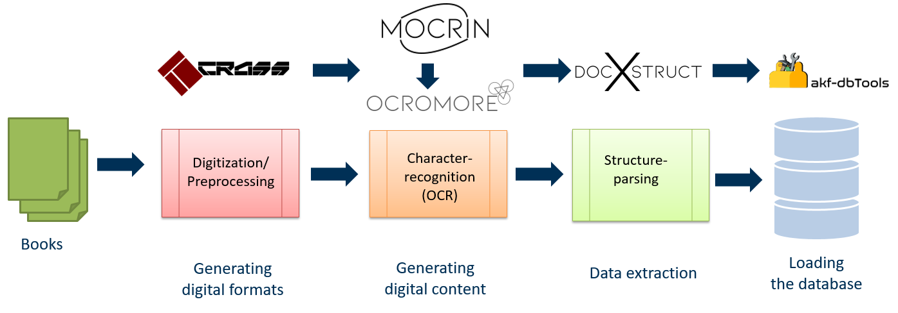

========================  

Overview
--------
The [Aktienführer data archive][akf-link] was created at the Mannheim University Library 
in a project funded by the German Research Association (DFG).  
We included data from the Aktienführer 1956-2016.
Until 1999, the data was published in book form. 
To extract the research data from these analoge source, 
the books from 1976-1999 were recorded manually,
the books from 1956-1975 were recorded automatically.
To gain the goal of automatically recording several tools were developed and 
published under the patronage of the Mannheim University Library.

[crass][crass-link] is a command line driven post-processing tool 
for scanned sheets of paper. The main purpose is to crop segments 
based on separator lines and splice them afterwards together in a certain order. 
In an additional preprocessing step, crass might detect the rotation of the page 
and will rotate it to the correct angle. This process is called "deskewing".

[mocrin][mocrin-link] is a command line driven processing tool for multiple ocr-engine.  
The main purpose is to handle multiple ocr-engine with one interface for 
a cleaner and uniform workflow. Another purpose is to serve as part of an self-configuration
process to extract the best settings for different ocr-engines. 
Just now you can store multiple configuration files for the ocr-engines.
It can also be used to cut out areas from image with user-set characteristics, which
can be further used as training datasets for NN-models.

[ocormore][ocromore-link] further parse the different ocr-outputfiles to a sqlite-database.
The purpose of this database is to serve as an exchange and store platform using 
pandas as handler. Combining pandas and the dataframe-objectifier offers a 
wide-range of performant use-cases like msa. 
To evaluate the results you can either use the common standard
isri tool to generate a accuracy report or do visual comparision with diff-tools (default "meld").

[docxstruct][docxstruct-link] analyses, categorizes and segments the data from textbased documents.
At the moment it is specialized to the `hocr` fileformat. 
The contained data in each segment will further get structured and parsed into a `json` file.

[dbTools][dbTools-link] is a collection of little scripts, 
which can modify and update certain parts of the database. 
Amongst other things it load the database with json-files 
from `docxstruct` and normalize and deduplicate the data.

Note that the automatic processing will sometimes need some manual adjustments.

Further Information
-------------------
See the website or the GitHub Tool-Repos.

Originally written by Jan Kamlah and Johannes Stegmüller.

[akf-link]: https://digi.bib.uni-mannheim.de/aktienfuehrer/
[crass-link]: https://github.com/UB-Mannheim/crass
[mocrin-link]: https://digi.bib.uni-mannheim.de/aktienfuehrer/
[ocromore-link]: https://github.com/UB-Mannheim/ocromore
[docxstruct-link]: https://digi.bib.uni-mannheim.de/aktienfuehrer/
[dbTools-link]: https://digi.bib.uni-mannheim.de/aktienfuehrer/