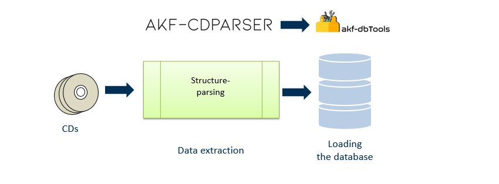

========================  

Overview
--------
The [Aktienführer-Datenarchiv][archiv-link] was created at the Mannheim University Library 
in a project funded by the German Research Association (DFG).  
We included data from the Aktienführer 1956-2016.
Until 1999, the data was published in book form.
To extract the research data from these analog sources different approaches were applied. 
The books from 1976-1999 were recorded manually, 
while the books from 1956-1975 were recorded automatically. 
The capturing from digital sources was performed automatically only. 
To reach the goal of automatically recording, several tools were developed and 
published under the patronage of the Mannheim University Library.
### Work process 
#### Books

[crass][crass-link] 
is a command line driven post-processing tool for scanned sheets of paper.  
It crops segments, based on separator lines, and
splices them afterwards together in a certain order to gain standalone, 
single-column text sections. This simplifies the layout analysis 
for following ocr steps and bundles related text sections.
In an additional pre-processing step, which is called deskewing, 
crass can also correct the rotation of the page.

[mocrin][mocrin-link]
is a command line driven processing tool for multiple ocr-engines.  
The main purpose is to handle multiple ocr-engines with one interface for 
a clean and uniform workflow. Another use is to serve as part of a self-configuration
process to extract the best settings for different ocr-engines (not fully implemented yet).
At the moment you can store multiple configuration files for the ocr-engines, 
which can be modified manually. So you can have a big collection of preconfigured settings
for different input data.
Furthermore it can cut areas out of images with user-set characteristics 
using regular expression, which can be used as training datasets for NN-models.

[ocormore][ocromore-link] 
unites the best parts of the individual ocr-output to produce an optimal outcome.   
In the first step, it parses the different ocr-outputfiles to a sqlite-database.
The purpose of this database is to serve as an exchange and store platform using 
pandas as handler. Combining pandas and the dataframe-objectifier offers a 
wide-range of performant use-cases like multi segment alignment (msa).
The combined output can be stored as new ocr-result or in plain text fileformat.
To evaluate the result you can either use the common standard ISRI tool 
to generate an accuracy report or do visual comparison with diff-tools (default "meld").

[docxstruct][docxstruct-link] 
analyses, categorizes and segments the data from text-based documents.  
At the moment it is specialized to the `hocr` fileformat. 
The contained data in each segment will be
parsed in a structured manner into a `json` file.

[dbTools][dbTools-link] 
is a collection of little scripts, 
which can modify and update certain parts of the akf-database.
The scripts are customized to the requirements of the project.   
Amongst other things it loads the database with json-files 
from `docxstruct` and normalizes and deduplicates the data in the database.

#### CDs

[akf-cdparser][cdparser-link]
analyses, categorizes and segments the data from text-based documents.
At the moment it is specialized to the `hocr` fileformat. 
The contained data in each segment will be
parsed in a structured manner into a `json` file.

[dbTools][dbTools-link] 
is a collection of little scripts, 
which can modify and update certain parts of the database. 
Amongst other things it loads the database with json-files 
from `docxstruct` and normalizes and deduplicates the data in the database.

Note that the automatic processing will sometimes need some manual adjustments.

Further Information
-------------------
See the website or the GitHub tool-repositories.

Copyright and License
----

Copyright (c) 2017 Universitätsbibliothek Mannheim

Author: 
 * [Jan Kamlah](https://github.com/jkamlah)
 * [Johannes Stegmüller](https://github.com/Hyper-Node)

The tools are Free Software. You may use them under the terms of the Apache 2.0 License.
See [LICENSE](./LICENSE) for details.

[archiv-link]: https://digi.bib.uni-mannheim.de/aktienfuehrer/
[crass-link]: https://github.com/UB-Mannheim/crass
[mocrin-link]: https://github.com/UB-Mannheim/mocrin
[ocromore-link]: https://github.com/UB-Mannheim/ocromore
[docxstruct-link]: https://github.com/UB-Mannheim/docxstruct
[dbTools-link]: https://github.com/UB-Mannheim/akf-dbtools
[cdparser-link]: https://github.com/UB-Mannheim/akf-cdparser